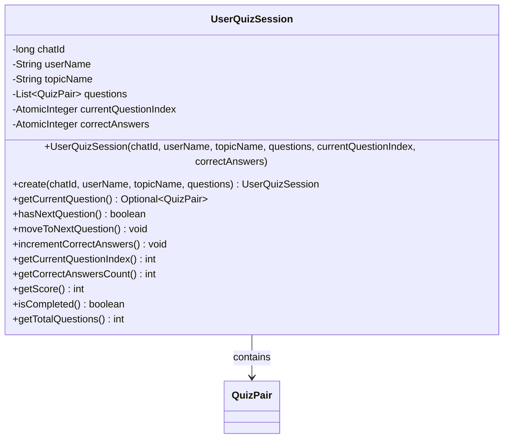

# Class Description: `UserQuizSession`

## Overview

[`UserQuizSession`](src/main/java/org/acme/model/UserQuizSession.java:16) is a **thread-safe, immutable-centric model class** that represents an active quiz session for a Telegram user. It manages the state of a quiz including the current question position and score tracking.



## Design Characteristics

| Aspect | Implementation |
|--------|----------------|
| **Thread Safety** | Uses [`AtomicInteger`](src/main/java/org/acme/model/UserQuizSession.java:9) for mutable state (lock-free) |
| **Immutability** | Core data (chatId, userName, topicName, questions) is immutable |
| **Defensive Copying** | Questions list is copied via [`List.copyOf()`](src/main/java/org/acme/model/UserQuizSession.java:49) |
| **Validation** | Constructor validates inputs via `requireNonEmpty()` helpers |
| **Builder Pattern** | Uses Lombok's [`@Builder`](src/main/java/org/acme/model/UserQuizSession.java:38) for flexible construction |

---

## Public Methods

### Factory Methods

#### [`create(long chatId, String userName, String topicName, List<QuizPair> questions)`](src/main/java/org/acme/model/UserQuizSession.java:57)
**Purpose:** Factory method for the common use case of creating a new quiz session with default starting values (index=0, correctAnswers=0).

**Returns:** A new `UserQuizSession` instance ready to start from the first question.

---

### Constructor

#### [`UserQuizSession(long chatId, String userName, String topicName, List<QuizPair> questions, int currentQuestionIndex, int correctAnswers)`](src/main/java/org/acme/model/UserQuizSession.java:39)
**Purpose:** Full constructor for creating a quiz session with explicit initial state. Useful for restoring sessions from persistence.

**Parameters:**
- `chatId` - Telegram chat identifier
- `userName` - Display name of the user (validated as non-empty)
- `topicName` - Quiz topic name (validated as non-empty)
- `questions` - List of quiz question-answer pairs (validated as non-empty, defensively copied)
- `currentQuestionIndex` - Starting position in the quiz (default: 0)
- `correctAnswers` - Initial correct answer count (default: 0)

---

### Navigation Methods

#### [`getCurrentQuestion()`](src/main/java/org/acme/model/UserQuizSession.java:76)
**Purpose:** Retrieves the current question to present to the user.

**Returns:** `Optional<QuizPair>` containing the current question, or `Optional.empty()` if the quiz is completed.

**Thread Safety:** Reads atomic index value safely.

---

#### [`hasNextQuestion()`](src/main/java/org/acme/model/UserQuizSession.java:87)
**Purpose:** Determines if there are remaining questions in the quiz.

**Returns:** `true` if more questions exist, `false` if the quiz is complete.

**Thread Safety:** Reads atomic index value safely.

---

#### [`moveToNextQuestion()`](src/main/java/org/acme/model/UserQuizSession.java:95)
**Purpose:** Advances the quiz to the next question. Uses atomic compare-and-update to prevent overshooting the end of the question list.

**Thread Safety:** Uses [`getAndUpdate()`](src/main/java/org/acme/model/UserQuizSession.java:96) for atomic increment with boundary check.

---

### Score Tracking

#### [`incrementCorrectAnswers()`](src/main/java/org/acme/model/UserQuizSession.java:105)
**Purpose:** Records a correct answer from the user. Called when the user answers correctly.

**Thread Safety:** Uses [`incrementAndGet()`](src/main/java/org/acme/model/UserQuizSession.java:106) for atomic increment.

---

#### [`getCorrectAnswersCount()`](src/main/java/org/acme/model/UserQuizSession.java:121)
**Purpose:** Returns the current number of correctly answered questions.

**Returns:** The count of correct answers as an `int`.

---

#### [`getScore()`](src/main/java/org/acme/model/UserQuizSession.java:128)
**Purpose:** Calculates the quiz performance as a percentage.

**Returns:** Score as integer percentage (0-100), calculated as `(correctAnswers * 100) / totalQuestions`.

---

### State Query Methods

#### [`getCurrentQuestionIndex()`](src/main/java/org/acme/model/UserQuizSession.java:113)
**Purpose:** Returns the zero-based index of the current question position.

**Returns:** Current question index as an `int`.

---

#### [`isCompleted()`](src/main/java/org/acme/model/UserQuizSession.java:136)
**Purpose:** Checks if the quiz has been completed (no more questions remaining).

**Returns:** `true` if all questions have been presented, `false` otherwise.

---

#### [`getTotalQuestions()`](src/main/java/org/acme/model/UserQuizSession.java:143)
**Purpose:** Returns the total number of questions in this quiz session.

**Returns:** The size of the questions list.

---

### Lombok-Generated Getters

The following getters are generated by the [`@Getter`](src/main/java/org/acme/model/UserQuizSession.java:15) annotation:

| Method | Returns |
|--------|---------|
| `getChatId()` | Telegram chat ID |
| `getUserName()` | User's display name |
| `getTopicName()` | Quiz topic name |
| `getQuestions()` | Immutable list of `QuizPair` questions |

---

## Usage Example

```java
// Create a new quiz session
UserQuizSession session = UserQuizSession.create(
    123456789L,           // chatId
    "JohnDoe",            // userName
    "German Vocabulary",  // topicName
    quizPairs             // List<QuizPair>
);

// Present questions
while (session.hasNextQuestion()) {
    QuizPair question = session.getCurrentQuestion().orElseThrow();
    // ... present question to user ...
    
    if (userAnswerIsCorrect) {
        session.incrementCorrectAnswers();
    }
    session.moveToNextQuestion();
}

// Show results
int score = session.getScore();  // e.g., 85 for 85%
```
