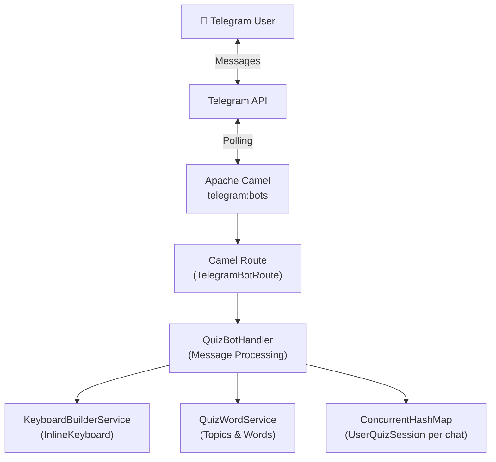
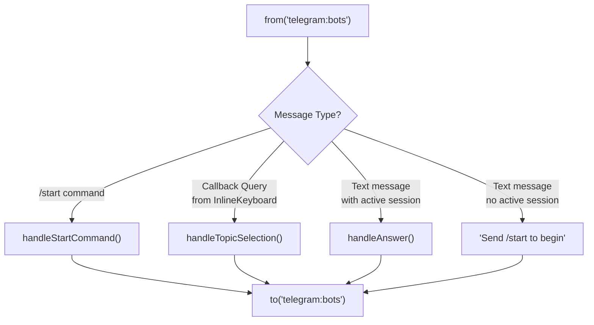

# 📖 Building a Telegram Quiz Bot with Quarkus & Apache Camel

> A step-by-step guide to creating an interactive vocabulary quiz bot using the Quarkus framework and Apache Camel Telegram extension.

---

## Table of Contents

1. [Architecture Overview](#1-architecture-overview)
2. [Project Setup & Dependencies](#2-project-setup--dependencies)
3. [Application Configuration](#3-application-configuration)
4. [Data Model Classes](#4-data-model-classes)
5. [Service Layer](#5-service-layer)
6. [Building the Camel Route — The Bot Brain](#6-building-the-camel-route--the-bot-brain)
7. [Step-by-Step Bot Algorithm Walkthrough](#7-step-by-step-bot-algorithm-walkthrough)
8. [Running & Testing the Bot](#8-running--testing-the-bot)
9. [Complete Code Listing](#9-complete-code-listing)

---

## 1. Architecture Overview

Our quiz bot follows a simple but effective architecture built on two core technologies:

- **Quarkus** — supersonic subatomic Java framework providing CDI, fast startup, and dev mode
- **Apache Camel Telegram Component** — handles all communication with the Telegram Bot API via polling



### Bot Workflow Summary

| Step | User Action | Bot Reaction |
|------|-------------|--------------|
| 1 | Sends `/start` | Shows topic selection InlineKeyboard |
| 2 | Taps a topic button | Creates quiz session, shows first question |
| 3 | Types an answer | Checks answer, shows next question |
| 4 | Answers last question | Shows final results with score |

---

## 2. Project Setup & Dependencies

### Step 2.1 — Create a New Quarkus Project

Use the Quarkus CLI or Maven plugin to scaffold a new project:

```bash
mvn io.quarkus.platform:quarkus-maven-plugin:3.17.8:create \
    -DprojectGroupId=org.acme \
    -DprojectArtifactId=telegram-quiz-bot \
    -Dextensions="camel-quarkus-telegram" \
    -DnoCode
```

Or, if you already have an existing Quarkus project, skip to the next step.

### Step 2.2 — Add Required Dependencies

Open your `pom.xml` and ensure the following dependencies are present:

```xml
<dependencies>
    <!-- Apache Camel Telegram Extension for Quarkus -->
    <dependency>
        <groupId>org.apache.camel.quarkus</groupId>
        <artifactId>camel-quarkus-telegram</artifactId>
    </dependency>

    <!-- Lombok for boilerplate reduction -->
    <dependency>
        <groupId>org.projectlombok</groupId>
        <artifactId>lombok</artifactId>
        <version>1.18.36</version>
        <scope>provided</scope>
    </dependency>

    <!-- Quarkus REST (if you need health/info endpoints) -->
    <dependency>
        <groupId>io.quarkus</groupId>
        <artifactId>quarkus-rest</artifactId>
    </dependency>
</dependencies>
```

> [!IMPORTANT]
> The `camel-quarkus-telegram` extension automatically brings in the core Camel Telegram component and all Telegram model classes (`OutgoingTextMessage`, `InlineKeyboardButton`, `InlineKeyboardMarkup`, `IncomingMessage`, etc.)

### Step 2.3 — Understand Key Telegram Model Classes

The Camel Telegram component provides Java model classes that map directly to the Telegram Bot API. Here are the ones we'll use:

| Class | Package | Purpose |
|-------|---------|---------|
| `OutgoingTextMessage` | `o.a.c.component.telegram.model` | Send text messages to users |
| `InlineKeyboardMarkup` | `o.a.c.component.telegram.model` | Inline keyboard attached to a message |
| `InlineKeyboardButton` | `o.a.c.component.telegram.model` | A single button in an inline keyboard |
| `IncomingMessage` | `o.a.c.component.telegram.model` | Incoming text message from user |

> [!NOTE]
> When a user presses an `InlineKeyboardButton`, the Telegram API sends a **callback query** — not a regular message.  In our Camel route, the exchange body will **not** be an `IncomingMessage` but will instead carry the callback data differently. We'll handle this by checking the body type in our route.

---

## 3. Application Configuration

### Step 3.1 — Create a Bot on Telegram

1. Open Telegram and find **@BotFather**
2. Send `/newbot` and follow the instructions
3. Copy the **authorization token** you receive (format: `123456789:ABCdefGHIjklMNOpqrSTUvwxYZ`)

### Step 3.2 — Configure `application.properties`

Create or update `src/main/resources/application.properties`:

```properties
# ─── Telegram Bot Configuration ────────────────────────────
# The authorization token from BotFather
telegram.authorization-token=${TELEGRAM_BOT_TOKEN:your-bot-token-here}

# Camel Telegram component configuration
camel.component.telegram.authorization-token=${telegram.authorization-token}

# ─── Quiz Configuration ───────────────────────────────────
quiz.source-lang=Hebrew
quiz.target-lang=Russian

# ─── Quarkus Configuration ────────────────────────────────
quarkus.log.category."org.apache.camel".level=INFO
```

> [!TIP]
> Use environment variables for sensitive data. Set `TELEGRAM_BOT_TOKEN` as an environment variable rather than hardcoding the token:
> ```bash
> export TELEGRAM_BOT_TOKEN="123456789:ABCdefGHIjklMNOpqrSTUvwxYZ"
> ```

---

## 4. Data Model Classes

### Step 4.1 — Create the `QuizPair` Record

This simple record holds a question-answer pair for the quiz.

📁 `src/main/java/org/acme/model/QuizPair.java`

```java
package org.acme.model;

/**
 * Represents a single quiz question-answer pair.
 *
 * @param wrdQuestion The word in the source language (question)
 * @param wrdAnswer   The word in the target language (expected answer)
 */
public record QuizPair(String wrdQuestion, String wrdAnswer) {
}
```

### Step 4.2 — Use the existing `UserQuizSession` Class

We already have our `UserQuizSession` class prepared. This class manages the state of an active quiz for a single user, providing:

- **Thread-safe** mutable state via `AtomicInteger` for `currentQuestionIndex` and `correctAnswers`
- **Immutable** core data: `chatId`, `userName`, `topicName`, and `questions` list
- **Navigation methods**: `getCurrentQuestion()`, `hasNextQuestion()`, `moveToNextQuestion()`
- **Score tracking**: `incrementCorrectAnswers()`, `getScore()`, `isCompleted()`

📁 `src/main/java/org/acme/model/UserQuizSession.java`

```java
package org.acme.model;

import lombok.Builder;
import lombok.Getter;

import java.util.Collection;
import java.util.List;
import java.util.Optional;
import java.util.concurrent.atomic.AtomicInteger;

/**
 * Thread-safe quiz session for a user.
 * Uses AtomicInteger for lock-free thread-safe mutable state.
 */
@Getter
public final class UserQuizSession {

    // Immutable data
    private final long chatId;
    private final String userName;
    private final String topicName;
    private final List<QuizPair> questions;

    // Mutable state - thread-safe using AtomicInteger
    private final AtomicInteger currentQuestionIndex;
    private final AtomicInteger correctAnswers;

    @Builder
    public UserQuizSession(
            long chatId,
            String userName,
            String topicName,
            List<QuizPair> questions,
            int currentQuestionIndex,
            int correctAnswers) {
        this.chatId = chatId;
        this.userName = requireNonEmpty(userName, "userName");
        this.topicName = requireNonEmpty(topicName, "topicName");
        this.questions = List.copyOf(requireNonEmpty(questions, "questions"));
        this.currentQuestionIndex = new AtomicInteger(currentQuestionIndex);
        this.correctAnswers = new AtomicInteger(correctAnswers);
    }

    /**
     * Factory method for common use case.
     */
    public static UserQuizSession create(
            long chatId,
            String userName,
            String topicName,
            List<QuizPair> questions) {
        return UserQuizSession.builder()
                .chatId(chatId)
                .userName(userName)
                .topicName(topicName)
                .questions(questions)
                .build();
    }

    public Optional<QuizPair> getCurrentQuestion() {
        int index = currentQuestionIndex.get();
        return index < questions.size()
                ? Optional.of(questions.get(index))
                : Optional.empty();
    }

    public boolean hasNextQuestion() {
        return currentQuestionIndex.get() < questions.size();
    }

    public void moveToNextQuestion() {
        currentQuestionIndex.getAndUpdate(current ->
                current < questions.size() ? current + 1 : current
        );
    }

    public void incrementCorrectAnswers() {
        correctAnswers.incrementAndGet();
    }

    public int getCurrentQuestionIndex() {
        return currentQuestionIndex.get();
    }

    public int getCorrectAnswersCount() {
        return correctAnswers.get();
    }

    public int getScore() {
        int total = questions.size();
        return total > 0 ? (getCorrectAnswersCount() * 100) / total : 0;
    }

    public boolean isCompleted() {
        return !hasNextQuestion();
    }

    public int getTotalQuestions() {
        return questions.size();
    }

    private static String requireNonEmpty(String value, String name) {
        if (value == null || value.trim().isEmpty()) {
            throw new IllegalArgumentException(name + " cannot be null or empty");
        }
        return value;
    }

    private static <T> Collection<? extends T> requireNonEmpty(
            Collection<? extends T> list, String name) {
        if (list == null || list.isEmpty()) {
            throw new IllegalArgumentException(name + " cannot be null or empty");
        }
        return list;
    }
}
```

> [!NOTE]
> **Key design decision:** We use `AtomicInteger` instead of synchronized blocks because quiz operations (increment index, increment score) are simple atomic operations. This provides better performance under concurrent access from multiple Telegram users.

---

## 5. Service Layer

### Step 5.1 — Create `QuizWordService`

This service provides the quiz data: available topics and word pairs for each topic. In a real application, this data might come from a database — but for our guide, we define a service interface that your existing implementation fulfills.

📁 `src/main/java/org/acme/service/QuizWordService.java`

```java
package org.acme.service;

import org.acme.model.QuizPair;

import java.util.List;

/**
 * Service providing quiz data: topics and word pairs.
 * 
 * Your implementation should provide concrete data
 * from a database, file, or API.
 */
public interface QuizWordService {

    /**
     * Returns the list of available quiz topic names.
     */
    List<String> getTopicsName();

    /**
     * Returns word pairs for a given topic and language combination.
     *
     * @param topicName  the quiz topic
     * @param sourceLang the source language (e.g., "Hebrew")
     * @param targetLang the target language (e.g., "Russian")
     * @return list of question-answer pairs
     */
    List<QuizPair> getWordPairs(String topicName, 
                                 String sourceLang, 
                                 String targetLang);
}
```

> [!NOTE]
> You already have an implementation of this service. The key methods we need are:
> - `getTopicsName()` — returns `List<String>` of available topics
> - `getWordPairs(topicName, sourceLang, targetLang)` — returns `List<QuizPair>` for the quiz session

### Step 5.2 — Create `KeyboardBuilderService`

This service builds Telegram InlineKeyboard markups for topic selection. Each topic becomes a button in the keyboard.

📁 `src/main/java/org/acme/service/KeyboardBuilderService.java`

```java
package org.acme.service;

import jakarta.enterprise.context.ApplicationScoped;
import jakarta.inject.Inject;
import org.apache.camel.component.telegram.model.InlineKeyboardButton;
import org.apache.camel.component.telegram.model.InlineKeyboardMarkup;

import java.util.Collections;
import java.util.List;

@ApplicationScoped
public class KeyboardBuilderService {

    public static final String CALLBACK_PREFIX = "topic:";

    @Inject
    QuizWordService quizWordService;

    /**
     * Builds an InlineKeyboardMarkup with all available topics.
     *
     * <p>Each topic gets its own row with a single button.
     * When pressed, the button sends callback data in the format
     * "topic: TopicName" which our route will parse.</p>
     *
     * @return InlineKeyboardMarkup with topic buttons
     */
    public InlineKeyboardMarkup buildTopicKeyboard() {

        List<String> topicsName = quizWordService.getTopicsName();

        InlineKeyboardMarkup.Builder kbBuilder = InlineKeyboardMarkup.builder();

        topicsName.stream()
                .map(topic -> InlineKeyboardButton.builder()
                        .text(topic)
                        .callbackData((CALLBACK_PREFIX + " %s").formatted(topic))
                        .build())
                .map(Collections::singletonList)
                .forEach(kbBuilder::addRow);

        return kbBuilder.build();
    }
}
```

**Let's break down what happens here step by step:**

1. **Get all topic names** — we call `quizWordService.getTopicsName()` to obtain a list of available quiz topic names
2. **Create a keyboard builder** — `InlineKeyboardMarkup.builder()` starts building our inline keyboard
3. **Map each topic to a button** — for each topic string, we create an `InlineKeyboardButton` with:
   - `.text(topic)` — the visible label on the button
   - `.callbackData("topic: TopicName")` — the data sent back to our bot when pressed
4. **One button per row** — `Collections::singletonList` wraps each button in a single-element list, then `addRow` places it on its own row
5. **Build** — `kbBuilder.build()` produces the final `InlineKeyboardMarkup`

> [!IMPORTANT]
> The `CALLBACK_PREFIX = "topic:"` is critical. When a user taps a button, Telegram sends a callback query with the `callbackData` string. Our route uses this prefix to identify that the callback is a topic selection and extract the topic name.

### Step 5.3 — Create `QuizBotHandler` — The Core Bot Logic

This is the heart of our bot. It manages active quiz sessions and processes all user interactions.

📁 `src/main/java/org/acme/service/QuizBotHandler.java`

```java
package org.acme.service;

import jakarta.enterprise.context.ApplicationScoped;
import jakarta.inject.Inject;
import org.acme.model.QuizPair;
import org.acme.model.UserQuizSession;
import org.apache.camel.component.telegram.model.InlineKeyboardMarkup;
import org.apache.camel.component.telegram.model.OutgoingTextMessage;
import org.eclipse.microprofile.config.inject.ConfigProperty;
import org.jboss.logging.Logger;

import java.util.List;
import java.util.Map;
import java.util.Optional;
import java.util.concurrent.ConcurrentHashMap;

@ApplicationScoped
public class QuizBotHandler {

    private static final Logger LOG = Logger.getLogger(QuizBotHandler.class);

    /**
     * Active quiz sessions indexed by Telegram chat ID.
     * ConcurrentHashMap ensures thread safety for concurrent user access.
     */
    private final Map<String, UserQuizSession> activeSessions = new ConcurrentHashMap<>();

    @Inject
    KeyboardBuilderService keyboardBuilderService;

    @Inject
    QuizWordService quizWordService;

    @ConfigProperty(name = "quiz.source-lang", defaultValue = "Hebrew")
    String sourceLang;

    @ConfigProperty(name = "quiz.target-lang", defaultValue = "Russian")
    String targetLang;

    // ──────────────────────────────────────────────────────────
    //  STEP 1: Handle /start command
    // ──────────────────────────────────────────────────────────

    /**
     * Handles the /start command by removing any existing session
     * and showing the topic selection keyboard.
     *
     * @param chatId the Telegram chat ID
     * @return OutgoingTextMessage with InlineKeyboard of topics
     */
    public OutgoingTextMessage handleStartCommand(String chatId) {
        LOG.infof("User %s started the quiz bot", chatId);

        // Remove any existing session for this user
        activeSessions.remove(chatId);

        // Build the topic selection keyboard
        InlineKeyboardMarkup keyboard = keyboardBuilderService.buildTopicKeyboard();

        // Create the welcome message with keyboard
        OutgoingTextMessage message = new OutgoingTextMessage();
        message.setText("""
                🎓 *Welcome to the Vocabulary Quiz Bot!*
                
                Choose a topic to start your quiz:
                """);
        message.setParseMode("Markdown");
        message.setReplyMarkup(keyboard);

        return message;
    }

    // ──────────────────────────────────────────────────────────
    //  STEP 2: Handle topic selection (callback query)
    // ──────────────────────────────────────────────────────────

    /**
     * Handles a topic selection from the InlineKeyboard callback.
     * Creates a new UserQuizSession and returns the first question.
     *
     * @param chatId    the Telegram chat ID
     * @param topicName the selected topic name
     * @param userName  the user's name
     * @return OutgoingTextMessage with the first quiz question
     */
    public OutgoingTextMessage handleTopicSelection(
            String chatId, String topicName, String userName) {

        LOG.infof("User %s selected topic: %s", chatId, topicName);

        // Get word pairs for the selected topic
        List<QuizPair> wordPairs = quizWordService.getWordPairs(
                topicName, sourceLang, targetLang);

        if (wordPairs == null || wordPairs.isEmpty()) {
            OutgoingTextMessage msg = new OutgoingTextMessage();
            msg.setText("⚠️ No questions found for topic: " + topicName 
                    + "\n\nType /start to choose another topic.");
            return msg;
        }

        // Create a new quiz session
        UserQuizSession session = UserQuizSession.create(
                Long.parseLong(chatId),
                userName != null ? userName : "User",
                topicName,
                wordPairs
        );

        // Store the session
        activeSessions.put(chatId, session);

        // Return the first question
        return buildQuestionMessage(session);
    }

    // ──────────────────────────────────────────────────────────
    //  STEP 3: Handle user answer
    // ──────────────────────────────────────────────────────────

    /**
     * Processes a user's answer to the current quiz question.
     * Compares the answer, records the result, and either
     * shows the next question or the final results.
     *
     * @param chatId     the Telegram chat ID
     * @param userAnswer the user's typed answer
     * @return OutgoingTextMessage with feedback + next question or results
     */
    public OutgoingTextMessage handleAnswer(String chatId, String userAnswer) {
        UserQuizSession session = activeSessions.get(chatId);

        // No active session
        if (session == null) {
            OutgoingTextMessage msg = new OutgoingTextMessage();
            msg.setText("🤔 No active quiz session.\n\nType /start to begin a new quiz!");
            return msg;
        }

        // Get the current question
        Optional<QuizPair> currentQuestion = session.getCurrentQuestion();
        if (currentQuestion.isEmpty()) {
            return buildResultsMessage(session);
        }

        QuizPair question = currentQuestion.get();
        StringBuilder response = new StringBuilder();

        // ── Check the answer using compareToIgnoreCase ──
        boolean isCorrect = userAnswer.trim()
                .compareToIgnoreCase(question.wrdAnswer().trim()) == 0;

        if (isCorrect) {
            session.incrementCorrectAnswers();
            response.append("✅ *Correct!*\n\n");
        } else {
            response.append("❌ *Incorrect!*\n")
                    .append("The correct answer is: *")
                    .append(question.wrdAnswer())
                    .append("*\n\n");
        }

        // Move to the next question
        session.moveToNextQuestion();

        // Check if quiz is completed
        if (session.isCompleted()) {
            // Remove the session and show results
            activeSessions.remove(chatId);
            response.append(buildResultsText(session));

            OutgoingTextMessage msg = new OutgoingTextMessage();
            msg.setText(response.toString());
            msg.setParseMode("Markdown");
            return msg;
        }

        // Show the next question
        response.append(buildQuestionText(session));

        OutgoingTextMessage msg = new OutgoingTextMessage();
        msg.setText(response.toString());
        msg.setParseMode("Markdown");
        return msg;
    }

    // ──────────────────────────────────────────────────────────
    //  Helper: Check if user has an active session
    // ──────────────────────────────────────────────────────────

    public boolean hasActiveSession(String chatId) {
        return activeSessions.containsKey(chatId);
    }

    // ──────────────────────────────────────────────────────────
    //  Private helper methods
    // ──────────────────────────────────────────────────────────

    /**
     * Builds a question message for the current quiz state.
     */
    private OutgoingTextMessage buildQuestionMessage(UserQuizSession session) {
        OutgoingTextMessage msg = new OutgoingTextMessage();
        msg.setText(buildQuestionText(session));
        msg.setParseMode("Markdown");
        return msg;
    }

    /**
     * Builds question text in the required format.
     */
    private String buildQuestionText(UserQuizSession session) {
        QuizPair question = session.getCurrentQuestion().orElseThrow();

        return """
                📚 *Question %d/%d*
                
                What is the %s translation of:
                🔤 *%s*
                
                Type your answer below:""".formatted(
                session.getCurrentQuestionIndex() + 1,
                session.getTotalQuestions(),
                targetLang,
                question.wrdQuestion()
        );
    }

    /**
     * Builds the final results message.
     */
    private OutgoingTextMessage buildResultsMessage(UserQuizSession session) {
        OutgoingTextMessage msg = new OutgoingTextMessage();
        msg.setText(buildResultsText(session));
        msg.setParseMode("Markdown");
        return msg;
    }

    /**
     * Builds the results text with emoji and score.
     */
    private String buildResultsText(UserQuizSession session) {
        int score = session.getScore();
        String emoji = score >= 80 ? "🏆" : score >= 50 ? "👍" : "💪";
        int incorrectCount = session.getTotalQuestions() 
                - session.getCorrectAnswersCount();

        return """
                🏁 *Quiz Complete!*
                
                %s Great job, %s!
                
                📊 *Final Results:*
                -------------------
                📚 Topic: %s
                ✅ Correct: %d
                ❌ Incorrect: %d
                📈 Score: %d%%
                
                Type /start to try another quiz!""".formatted(
                emoji,
                session.getUserName(),
                session.getTopicName(),
                session.getCorrectAnswersCount(),
                incorrectCount,
                score
        );
    }
}
```

**Key design decisions in `QuizBotHandler`:**

- **`ConcurrentHashMap<String, UserQuizSession>`** — stores one session per chat ID, thread-safe for concurrent users
- **Session lifecycle** — created on topic selection, removed on quiz completion or new `/start`
- **Answer comparison** — uses `compareToIgnoreCase() == 0` as specified, with `.trim()` to forgive whitespace

---

## 6. Building the Camel Route — The Bot Brain

### Step 6.1 — Understanding the Route Structure

The Camel route is where everything comes together. It:
1. **Polls** the Telegram API for new messages/callbacks
2. **Routes** each incoming update based on its type (command, callback query, or text answer)
3. **Sends** the response back to the user



### Step 6.2 — Create `TelegramBotRoute`

📁 `src/main/java/org/acme/route/TelegramBotRoute.java`

```java
package org.acme.route;

import jakarta.enterprise.context.ApplicationScoped;
import jakarta.inject.Inject;
import org.acme.service.KeyboardBuilderService;
import org.apache.camel.builder.RouteBuilder;
import org.apache.camel.component.telegram.model.IncomingMessage;
import org.apache.camel.component.telegram.model.OutgoingTextMessage;

@ApplicationScoped
public class TelegramBotRoute extends RouteBuilder {

    @Inject
    QuizBotHandler quizBotHandler;

    @Override
    public void configure() throws Exception {

        // ═══════════════════════════════════════════════════════
        //  MAIN ROUTE: Receive all Telegram updates
        // ═══════════════════════════════════════════════════════
        from("telegram:bots")
                .routeId("telegram-quiz-bot")
                .log("Received message type: ${body.class.simpleName}")
                .choice()

                // ─── CASE 1: Text message (commands + answers) ───
                .when(body().isInstanceOf(IncomingMessage.class))
                .process(exchange -> {
                    IncomingMessage incoming = exchange.getIn()
                            .getBody(IncomingMessage.class);

                    String chatId = exchange.getIn()
                            .getHeader("CamelTelegramChatId", String.class);

                    String text = incoming.getText();

                    OutgoingTextMessage response;

                    if ("/start".equalsIgnoreCase(text)) {
                        // ── Step 1: Handle /start command ──
                        response = quizBotHandler.handleStartCommand(chatId);

                    } else if (quizBotHandler.hasActiveSession(chatId)) {
                        // ── Step 5: Handle quiz answer ──
                        response = quizBotHandler.handleAnswer(chatId, text);

                    } else {
                        // ── No session, no command ──
                        response = new OutgoingTextMessage();
                        response.setText(
                                "🤖 Hello! Type /start to begin a vocabulary quiz."
                        );
                    }

                    exchange.getIn().setBody(response);
                })

                // ─── CASE 2: Callback query (InlineKeyboard press) ───
                .when(header("CamelTelegramCallbackQuery").isNotNull())
                .process(exchange -> {
                    // Extract callback data from the header
                    String callbackData = exchange.getIn()
                            .getHeader("CamelTelegramCallbackQuery",
                                    String.class);

                    String chatId = exchange.getIn()
                            .getHeader("CamelTelegramChatId", String.class);

                    // Parse the topic name from callback data
                    // Format: "topic: TopicName"
                    if (callbackData != null && callbackData
                            .startsWith(KeyboardBuilderService.CALLBACK_PREFIX)) {

                        String topicName = callbackData
                                .substring(KeyboardBuilderService
                                        .CALLBACK_PREFIX.length())
                                .trim();

                        // Get user name if available
                        String userName = exchange.getIn()
                                .getHeader("CamelTelegramChatUserName",
                                        String.class);
                        if (userName == null || userName.isEmpty()) {
                            userName = "User";
                        }

                        // ── Step 3: Handle topic selection ──
                        OutgoingTextMessage response =
                                quizBotHandler.handleTopicSelection(
                                        chatId, topicName, userName);

                        exchange.getIn().setBody(response);
                    }
                })

                .otherwise()
                .log("Unhandled message type: ${body.class.simpleName}")

                .end()

                // ─── Send the response back to Telegram ───
                .to("telegram:bots");
    }
}
```

### Step 6.3 — Understanding the Route in Detail

Let's walk through each part of the route:

#### 6.3.1 — The Consumer: `from("telegram:bots")`

```java
from("telegram:bots")
```

This creates a **polling consumer** that periodically checks the Telegram Bot API for new updates. The `bots` path tells Camel to use the Long Polling mode. The bot token is automatically picked up from the Camel component configuration we set in `application.properties`.

> [!NOTE]
> You don't need to specify the authorization token in the URI if you've configured it at the component level via `camel.component.telegram.authorization-token` in `application.properties`.

#### 6.3.2 — The Content-Based Router: `choice()`

We use Camel's Content-Based Router pattern to handle different types of incoming updates:

| Condition | What it matches | Handler |
|-----------|-----------------|---------|
| `body().isInstanceOf(IncomingMessage.class)` | Regular text messages including `/start` | Commands & quiz answers |
| `header("CamelTelegramCallbackQuery").isNotNull()` | Callback query from InlineKeyboard button press | Topic selection |

#### 6.3.3 — Key Camel Telegram Headers

The Camel Telegram component automatically sets these headers on incoming messages:

| Header | Type | Description |
|--------|------|-------------|
| `CamelTelegramChatId` | `String` | The chat ID of the conversation |
| `CamelTelegramCallbackQuery` | `String` | Callback data when an InlineKeyboard button is pressed |
| `CamelTelegramChatUserName` | `String` | The username of the message sender |

#### 6.3.4 — The Producer: `to("telegram:bots")`

```java
.to("telegram:bots");
```

At the end of the route, whatever `OutgoingTextMessage` we placed in the exchange body gets sent back to the user. The `CamelTelegramChatId` header (still set from the incoming message) tells Camel which chat to reply to.

---

## 7. Step-by-Step Bot Algorithm Walkthrough

Here's the complete flow, mapping each user interaction to the code:

### 🔵 Step 1 — User Sends `/start`

```
User ──► "/start" ──► Telegram API ──► Camel Route
```

**What happens in code:**

1. The Camel route receives an `IncomingMessage` with text `"/start"`
2. The `choice()` matches `body().isInstanceOf(IncomingMessage.class)`
3. Inside the processor, `"/start".equalsIgnoreCase(text)` is `true`
4. `quizBotHandler.handleStartCommand(chatId)` is called
5. Any existing session for this user is removed
6. `keyboardBuilderService.buildTopicKeyboard()` builds the InlineKeyboard
7. An `OutgoingTextMessage` with the welcome text and keyboard markup is returned

**User sees:**
```
🎓 Welcome to the Vocabulary Quiz Bot!

Choose a topic to start your quiz:

[📗 Topic One    ]
[📘 Topic Two    ]
[📙 Topic Three  ]
```

### 🟢 Step 2 — User Selects a Topic

```
User ──► taps "Topic One" button ──► Callback Query ──► Camel Route
```

**What happens in code:**

1. The Camel route receives a callback query (not an `IncomingMessage`)
2. The `choice()` matches `header("CamelTelegramCallbackQuery").isNotNull()`
3. The callback data `"topic: Topic One"` is extracted from the header
4. The topic name `"Topic One"` is parsed by removing the `CALLBACK_PREFIX`
5. `quizBotHandler.handleTopicSelection(chatId, "Topic One", userName)` is called
6. `quizWordService.getWordPairs("Topic One", "Hebrew", "Russian")` fetches the word pairs
7. A new `UserQuizSession` is created and stored in `activeSessions`
8. The first question is built and returned

**User sees:**
```
📚 Question 1/10

What is the Russian translation of:
🔤 שלום

Type your answer below:
```

### 🟡 Steps 3–5 — User Answers Questions

```
User ──► types "Привет" ──► Text Message ──► Camel Route
```

**What happens in code:**

1. The Camel route receives an `IncomingMessage` with text `"Привет"`
2. The `choice()` matches `body().isInstanceOf(IncomingMessage.class)`
3. Text is not `/start`, so we check `quizBotHandler.hasActiveSession(chatId)` → `true`
4. `quizBotHandler.handleAnswer(chatId, "Привет")` is called
5. The current `QuizPair` is retrieved: `("שלום", "Привет")`
6. **Answer check:** `"Привет".compareToIgnoreCase("Привет") == 0` → ✅ correct!
7. `session.incrementCorrectAnswers()` is called
8. `session.moveToNextQuestion()` advances to the next question
9. If `session.isCompleted()` is `false`, the next question is shown

**User sees (correct answer):**
```
✅ Correct!

📚 Question 2/10

What is the Russian translation of:
🔤 תודה

Type your answer below:
```

**User sees (incorrect answer):**
```
❌ Incorrect!
The correct answer is: Спасибо

📚 Question 3/10

What is the Russian translation of:
🔤 בוקר טוב

Type your answer below:
```

### 🔴 Step 6 — Quiz Complete

When the user answers the last question:

**What happens in code:**

1. After processing the last answer, `session.isCompleted()` returns `true`
2. The session is removed from `activeSessions`
3. `buildResultsText(session)` generates the final score display
4. The score percentage is calculated with `session.getScore()`

**User sees:**
```
✅ Correct!

🏁 Quiz Complete!

🏆 Great job, John!

📊 Final Results:
-------------------
📚 Topic: Topic One
✅ Correct: 8
❌ Incorrect: 2
📈 Score: 80%

Type /start to try another quiz!
```

---

## 8. Running & Testing the Bot

### Step 8.1 — Set Your Bot Token

```bash
export TELEGRAM_BOT_TOKEN="123456789:ABCdefGHIjklMNOpqrSTUvwxYZ"
```

### Step 8.2 — Run in Dev Mode

```bash
./mvnw quarkus:dev
```

Quarkus Dev Mode gives you:
- 🔄 **Live reload** — changes to code are instantly applied
- 📊 **Dev UI** — available at `http://localhost:8080/q/dev`
- 📝 **Logging** — all Camel route activity is logged to the console

### Step 8.3 — Test the Bot

1. Open Telegram and find your bot by its username
2. Send `/start`
3. Tap a topic button from the inline keyboard
4. Answer each question by typing the translation
5. View your results after the last question

### Step 8.4 — Monitoring & Debugging

Watch the Quarkus console for log output:

```
INFO  [telegram-quiz-bot] Received message type: IncomingMessage
INFO  [org.acm.ser.QuizBotHandler] User 123456 started the quiz bot
INFO  [telegram-quiz-bot] Received message type: IncomingCallbackQuery  
INFO  [org.acm.ser.QuizBotHandler] User 123456 selected topic: Animals
```

> [!TIP]
> Use the Quarkus Dev UI at `http://localhost:8080/q/dev-ui` to inspect Camel routes, view route statistics, and check the health of your application.

---

## 9. Complete Code Listing

### Project Structure

```
telegram-quiz-bot/
├── pom.xml
└── src/
    └── main/
        ├── java/
        │   └── org/
        │       └── acme/
        │           ├── model/
        │           │   ├── QuizPair.java
        │           │   └── UserQuizSession.java
        │           ├── route/
        │           │   └── TelegramBotRoute.java
        │           └── service/
        │               ├── KeyboardBuilderService.java
        │               ├── QuizBotHandler.java
        │               └── QuizWordService.java
        └── resources/
            └── application.properties
```

### Summary of Classes and Responsibilities

| Class | Type | Responsibility |
|-------|------|----------------|
| `QuizPair` | Record | Holds a word question-answer pair |
| `UserQuizSession` | Model | Manages quiz state per user (thread-safe) |
| `QuizWordService` | Service | Provides topics and word pairs data |
| `KeyboardBuilderService` | Service | Builds InlineKeyboard for topic selection |
| `QuizBotHandler` | Service | Core bot logic: commands, answers, results |
| `TelegramBotRoute` | Route | Camel route: receives & routes Telegram updates |

### Key Apache Camel Concepts Used

| Concept | How We Use It |
|---------|---------------|
| **Consumer** (`from`) | Poll Telegram API for updates |
| **Content-Based Router** (`choice/when`) | Route by message type |
| **Processor** (`.process()`) | Transform incoming messages into responses |
| **Producer** (`to`) | Send responses back via Telegram API |
| **Component-Level Config** | Set bot token once in `application.properties` |

---

> [!TIP]
> **Next Steps to Enhance Your Bot:**
> - Add a `/help` command explaining the bot's capabilities
> - Implement a hint system (e.g., show the first letter of the answer)
> - Add support for multiple languages (not just Hebrew → Russian)
> - Persist quiz history to a database using Quarkus Panache
> - Add timer-based quizzes with countdown pressure
> - Implement leaderboards across users
