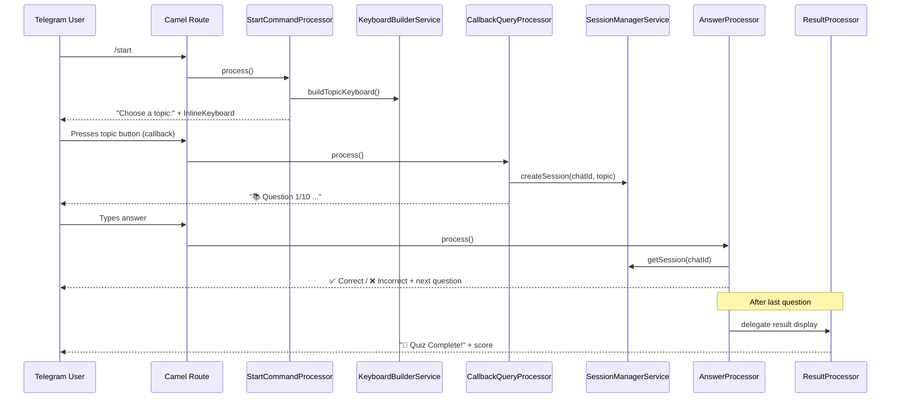
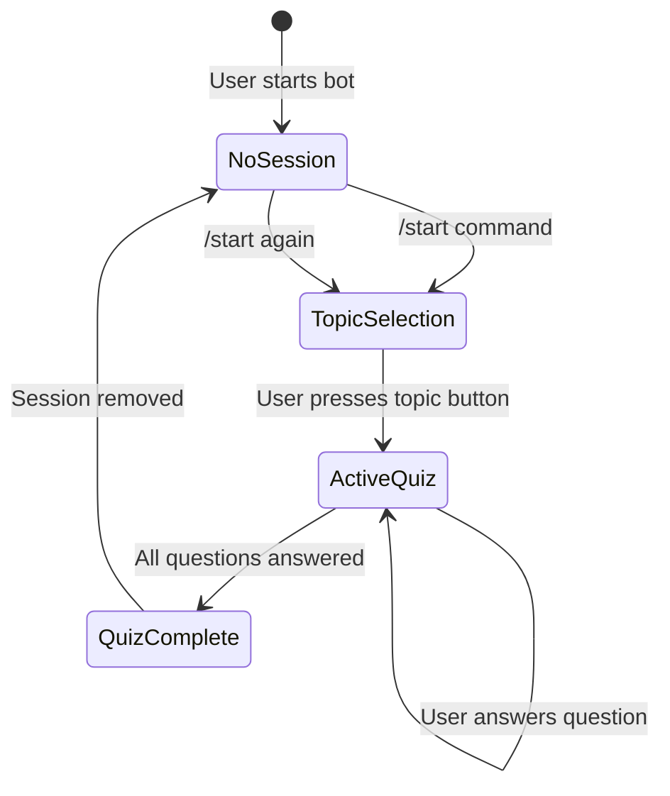
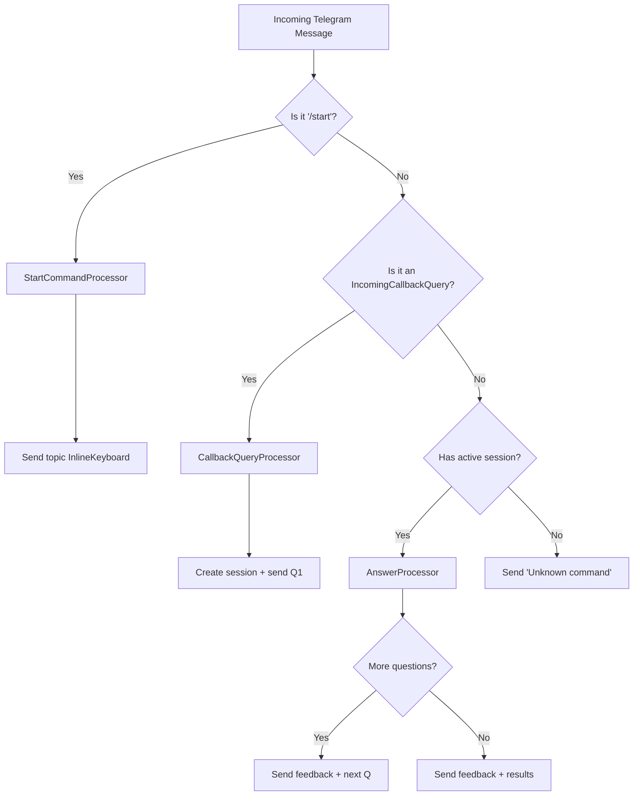

# 🤖 Building a Telegram Quiz Bot with Quarkus & Apache Camel

A step-by-step guide to creating a foreign-language vocabulary quiz bot using Quarkus, Apache Camel Telegram extension, and dedicated processor classes.

---

## Table of Contents

1. [Architecture Overview](#1-architecture-overview)
2. [Project Setup & Dependencies](#2-project-setup--dependencies)
3. [Application Configuration](#3-application-configuration)
4. [Data Model Classes](#4-data-model-classes)
5. [Service Layer](#5-service-layer)
6. [Session Management](#6-session-management)
7. [Processor Classes](#7-processor-classes)
8. [The Apache Camel Route](#8-the-apache-camel-route)
9. [Running & Testing](#9-running--testing)
10. [Summary & Final Project Structure](#10-summary--final-project-structure)

---

## 1. Architecture Overview

Our bot follows a **processor-based architecture** — we avoid monolithic "god" classes by delegating business logic to dedicated CDI-managed processor classes that are invoked from the Apache Camel route. This approach keeps the route definition clean and each processor focused on a single responsibility.

### Bot Flow Diagram



### Project Structure

```
src/main/java/org/acme/
├── model/
│   ├── QuizPair.java                  # Record: (wrdQuestion, wrdAnswer)
│   └── UserQuizSession.java           # Thread-safe quiz session (already created)
├── service/
│   ├── QuizWordService.java           # Provides topics and word pairs
│   ├── KeyboardBuilderService.java    # Builds InlineKeyboard for topics
│   └── SessionManagerService.java     # Manages active quiz sessions per user
├── processor/
│   ├── StartCommandProcessor.java     # Handles /start → shows topic keyboard
│   ├── CallbackQueryProcessor.java    # Handles topic selection → starts quiz
│   ├── AnswerProcessor.java           # Handles user text answers during quiz
│   └── ResultProcessor.java           # Builds and returns quiz results
└── route/
    └── TelegramBotRoute.java          # Main Apache Camel route definition
```

---

## 2. Project Setup & Dependencies

### Step 2.1 — Create a New Quarkus Project

Open your terminal and generate a new Quarkus project using the Quarkus CLI or Maven:

```bash
mvn io.quarkus.platform:quarkus-maven-plugin:3.17.8:create \
    -DprojectGroupId=org.acme \
    -DprojectArtifactId=telegram-quiz-bot \
    -Dextensions="camel-quarkus-telegram" \
    -DnoCode
```

> [!TIP]
> You can also use the Quarkus CLI: `quarkus create app org.acme:telegram-quiz-bot --extension=camel-quarkus-telegram --no-code`

### Step 2.2 — Add Required Dependencies

Open `pom.xml` and ensure the following dependencies are present:

```xml
<dependencies>
    <!-- Apache Camel Telegram Extension for Quarkus -->
    <dependency>
        <groupId>org.apache.camel.quarkus</groupId>
        <artifactId>camel-quarkus-telegram</artifactId>
    </dependency>

    <!-- Lombok for boilerplate reduction -->
    <dependency>
        <groupId>org.projectlombok</groupId>
        <artifactId>lombok</artifactId>
        <version>1.18.36</version>
        <scope>provided</scope>
    </dependency>

    <!-- Quarkus Arc (CDI) — included by default -->
    <dependency>
        <groupId>io.quarkus</groupId>
        <artifactId>quarkus-arc</artifactId>
    </dependency>
</dependencies>
```

> [!IMPORTANT]
> The `camel-quarkus-telegram` extension transitively brings in the Apache Camel core and the Telegram component, so you don't need to add them separately. The Quarkus BOM manages the version automatically.

---

## 3. Application Configuration

### Step 3.1 — Configure the Telegram Bot Token

Create or edit `src/main/resources/application.properties`:

```properties
# ──────────────────────────────────────────────
# Telegram Bot Configuration
# ──────────────────────────────────────────────
# Your Telegram Bot API token from @BotFather
camel.component.telegram.authorization-token=${TELEGRAM_BOT_TOKEN}
```

> [!CAUTION]
> **Never hardcode your bot token** in the properties file. Use an environment variable `TELEGRAM_BOT_TOKEN` instead. You can set it in your shell before running:
> ```bash
> export TELEGRAM_BOT_TOKEN="123456:ABC-DEF1234ghIkl-zyx57W2v1u123ew11"
> ```
> Alternatively, create a `.env` file (add it to `.gitignore`) and Quarkus will read it automatically.

### How It Works

When you use the endpoint URI `telegram:bots` in your Camel route, the Telegram component automatically uses the token configured via `camel.component.telegram.authorization-token`. The `bots` part of the URI is a special shorthand — it tells Camel to operate in "bots" mode, polling for incoming updates and sending replies.

---

## 4. Data Model Classes

### Step 4.1 — Create the `QuizPair` Record

This simple Java record holds a question-answer pair for the quiz.

**File:** `src/main/java/org/acme/model/QuizPair.java`

```java
package org.acme.model;

/**
 * Represents a single quiz question-answer pair.
 *
 * @param wrdQuestion The word in the source language (e.g., Hebrew)
 * @param wrdAnswer   The expected answer in the target language (e.g., Russian)
 */
public record QuizPair(String wrdQuestion, String wrdAnswer) {
}
```

> [!NOTE]
> We use a Java `record` because quiz pairs are immutable value objects — they are created once and never modified. Records automatically generate `equals()`, `hashCode()`, `toString()`, and accessor methods.

### Step 4.2 — The `UserQuizSession` Class (Already Created)

You already have the `UserQuizSession` class. It is a **thread-safe, immutable-centric model** that tracks a user's quiz progress. Here's a quick summary of its key API that we'll use throughout the processors:

| Method | Purpose |
|--------|---------|
| `UserQuizSession.create(chatId, userName, topicName, questions)` | Factory method to create a new session |
| `getCurrentQuestion()` | Returns `Optional<QuizPair>` for the current question |
| `hasNextQuestion()` | Checks if more questions remain |
| `moveToNextQuestion()` | Advances to the next question (atomic) |
| `incrementCorrectAnswers()` | Increments correct answer counter (atomic) |
| `getCurrentQuestionIndex()` | Returns zero-based index of current question |
| `getCorrectAnswersCount()` | Returns count of correct answers |
| `getTotalQuestions()` | Returns total number of questions |
| `getScore()` | Returns percentage score (0–100) |
| `isCompleted()` | Returns `true` if all questions have been presented |

---

## 5. Service Layer

### Step 5.1 — Create the `QuizWordService`

This service provides topic names and word pairs. The actual data source (database, file, API) is an implementation detail — here we show the interface contract.

**File:** `src/main/java/org/acme/service/QuizWordService.java`

```java
package org.acme.service;

import jakarta.enterprise.context.ApplicationScoped;
import org.acme.model.QuizPair;

import java.util.List;

/**
 * Service that provides quiz topics and word pairs.
 * 
 * The actual implementation should connect to your data source
 * (database, REST API, or configuration file).
 */
@ApplicationScoped
public class QuizWordService {

    /**
     * Returns a sorted list of all available topic names.
     *
     * @return list of topic names
     */
    public List<String> getTopicsName() {
        // Replace with actual data source logic
        return List.of("Animals", "Colors", "Family", "Food", "Greetings");
    }

    /**
     * Returns word pairs for a given topic.
     *
     * @param topicName  the quiz topic
     * @param sourceLang source language (e.g., "Hebrew")
     * @param targetLang target language (e.g., "Russian")
     * @return list of quiz pairs for the topic
     */
    public List<QuizPair> getWordPairs(String topicName, 
                                        String sourceLang, 
                                        String targetLang) {
        // Replace with actual data source logic
        // Example stub data:
        return List.of(
            new QuizPair("שלום", "Привет"),
            new QuizPair("תודה", "Спасибо"),
            new QuizPair("כן", "Да")
        );
    }
}
```

> [!NOTE]
> In a production application, this service would inject a repository or REST client. The `sourceLang` and `targetLang` parameters are kept for extensibility, but in our bot we always pass `"Hebrew"` and `"Russian"`.

### Step 5.2 — Create the `KeyboardBuilderService`

This service builds the `InlineKeyboardMarkup` from the list of topic names. Each topic becomes a button in its own row.

**File:** `src/main/java/org/acme/service/KeyboardBuilderService.java`

```java
package org.acme.service;

import jakarta.enterprise.context.ApplicationScoped;
import jakarta.inject.Inject;
import org.apache.camel.component.telegram.model.InlineKeyboardButton;
import org.apache.camel.component.telegram.model.InlineKeyboardMarkup;

import java.util.Collections;
import java.util.List;

@ApplicationScoped
public class KeyboardBuilderService {

    /**
     * Prefix for callback data to identify topic selections.
     * When Telegram sends back a callback, the data will be "topic: Animals", etc.
     */
    public static final String CALLBACK_PREFIX = "topic:";

    @Inject
    QuizWordService quizWordService;

    /**
     * Builds an InlineKeyboardMarkup with one button per topic.
     * Each button's callback data is prefixed with "topic: " followed by the topic name.
     *
     * @return InlineKeyboardMarkup ready to attach to an OutgoingTextMessage
     */
    public InlineKeyboardMarkup buildTopicKeyboard() {

        List<String> topicsName = quizWordService.getTopicsName();

        InlineKeyboardMarkup.Builder kbBuilder = InlineKeyboardMarkup.builder();

        topicsName.stream()
                .map(topic -> InlineKeyboardButton.builder()
                        .text(topic)                                           // Display text
                        .callbackData((CALLBACK_PREFIX + " %s").formatted(topic)) // Callback payload
                        .build())
                .map(Collections::singletonList)  // Each button in its own row
                .forEach(kbBuilder::addRow);

        return kbBuilder.build();
    }
}
```

**How InlineKeyboard works:**

1. **`InlineKeyboardButton.builder()`** — Creates a button with display `.text()` and a `.callbackData()` payload that Telegram sends back when the button is pressed.
2. **`Collections::singletonList`** — Wraps each button in a single-element list, effectively placing each button on its own row.
3. **`kbBuilder::addRow`** — Adds each row to the keyboard markup.
4. When the user presses a button, Telegram sends an `IncomingCallbackQuery` back to our bot, where `.getData()` returns the callback data string (e.g., `"topic: Animals"`).

### Step 5.3 — Create the `SessionManagerService`

This service manages active quiz sessions using a `ConcurrentHashMap`, keyed by Telegram `chatId`.

**File:** `src/main/java/org/acme/service/SessionManagerService.java`

```java
package org.acme.service;

import jakarta.enterprise.context.ApplicationScoped;
import org.acme.model.QuizPair;
import org.acme.model.UserQuizSession;

import java.util.List;
import java.util.Optional;
import java.util.concurrent.ConcurrentHashMap;
import java.util.concurrent.ConcurrentMap;

/**
 * Manages active quiz sessions for users.
 * 
 * Sessions are stored in a ConcurrentHashMap keyed by chatId.
 * Thread-safe for concurrent access from multiple Camel routes.
 */
@ApplicationScoped
public class SessionManagerService {

    private final ConcurrentMap<Long, UserQuizSession> activeSessions = new ConcurrentHashMap<>();

    /**
     * Creates and stores a new quiz session for the given chat.
     * If a session already exists for this chatId, it is replaced.
     *
     * @param chatId    Telegram chat ID
     * @param userName  user's display name
     * @param topicName selected topic name
     * @param questions list of quiz pairs
     * @return the newly created session
     */
    public UserQuizSession createSession(long chatId, 
                                          String userName, 
                                          String topicName,
                                          List<QuizPair> questions) {
        UserQuizSession session = UserQuizSession.create(chatId, userName, topicName, questions);
        activeSessions.put(chatId, session);
        return session;
    }

    /**
     * Retrieves the active session for a given chat, if one exists.
     *
     * @param chatId Telegram chat ID
     * @return Optional containing the session, or empty if no active session
     */
    public Optional<UserQuizSession> getSession(long chatId) {
        return Optional.ofNullable(activeSessions.get(chatId));
    }

    /**
     * Removes the session for a given chat (e.g., after quiz completion).
     *
     * @param chatId Telegram chat ID
     */
    public void removeSession(long chatId) {
        activeSessions.remove(chatId);
    }

    /**
     * Checks if a user currently has an active quiz session.
     *
     * @param chatId Telegram chat ID
     * @return true if an active session exists
     */
    public boolean hasActiveSession(long chatId) {
        return activeSessions.containsKey(chatId);
    }
}
```

> [!TIP]
> We use `ConcurrentHashMap` because multiple Telegram users can interact with the bot simultaneously, and Camel may process messages on different threads. The `UserQuizSession` itself also uses `AtomicInteger` for its mutable state — a double layer of thread safety.

---

## 6. Session Management

The session lifecycle follows this pattern:



1. **No Session** — The user has no active quiz. Any text message gets the "Unknown command" response.
2. **Topic Selection** — The `/start` command shows the InlineKeyboard. No session is created yet.
3. **Active Quiz** — A callback query creates the session. The user answers questions one by one.
4. **Quiz Complete** — After the last question, results are shown and the session is removed.

---

## 7. Processor Classes

Following the architecture pattern from `TelegramBotRoute.java`, we use dedicated processor classes instead of putting logic directly in the route. Each processor implements `org.apache.camel.Processor` and is a CDI bean.

### Step 7.1 — Create `StartCommandProcessor`

This processor handles the `/start` command. It builds a welcome message with an InlineKeyboard showing available topics.

**File:** `src/main/java/org/acme/processor/StartCommandProcessor.java`

```java
package org.acme.processor;

import jakarta.enterprise.context.ApplicationScoped;
import jakarta.inject.Inject;
import org.acme.service.KeyboardBuilderService;
import org.apache.camel.Exchange;
import org.apache.camel.Processor;
import org.apache.camel.component.telegram.model.InlineKeyboardMarkup;
import org.apache.camel.component.telegram.model.OutgoingTextMessage;

/**
 * Handles the /start command.
 * Sends a welcome message with an InlineKeyboard listing available quiz topics.
 */
@ApplicationScoped
public class StartCommandProcessor implements Processor {

    @Inject
    KeyboardBuilderService keyboardBuilderService;

    @Override
    public void process(Exchange exchange) throws Exception {

        // Build the InlineKeyboard with topic buttons
        InlineKeyboardMarkup keyboard = keyboardBuilderService.buildTopicKeyboard();

        // Create the outgoing message with the keyboard attached
        OutgoingTextMessage message = new OutgoingTextMessage();
        message.setText("🎓 *Welcome to the Language Quiz Bot!*\n\n"
                + "Choose a topic below to start your quiz:");
        message.setParseMode("Markdown");
        message.setReplyMarkup(keyboard);

        // Set the message as the exchange body — Camel Telegram will send it
        exchange.getIn().setBody(message);
    }
}
```

**Key points:**
- `OutgoingTextMessage` is the Camel Telegram model used to construct rich messages.
- `.setReplyMarkup(keyboard)` attaches the `InlineKeyboardMarkup` to the message.
- `.setParseMode("Markdown")` enables Markdown formatting (bold, italic, etc.).
- The Camel route sends this message by routing it to `"telegram:bots"`.

### Step 7.2 — Create `CallbackQueryProcessor`

This processor handles InlineKeyboard button presses (callback queries). When a user selects a topic, it creates a quiz session and sends the first question.

**File:** `src/main/java/org/acme/processor/CallbackQueryProcessor.java`

```java
package org.acme.processor;

import jakarta.enterprise.context.ApplicationScoped;
import jakarta.inject.Inject;
import org.acme.model.QuizPair;
import org.acme.model.UserQuizSession;
import org.acme.service.QuizWordService;
import org.acme.service.SessionManagerService;
import org.apache.camel.Exchange;
import org.apache.camel.Processor;
import org.apache.camel.component.telegram.model.IncomingCallbackQuery;
import org.apache.camel.component.telegram.model.OutgoingTextMessage;

import java.util.List;

import static org.acme.service.KeyboardBuilderService.CALLBACK_PREFIX;
import static org.apache.camel.component.telegram.TelegramConstants.TELEGRAM_CHAT_ID;

/**
 * Handles callback queries from InlineKeyboard button presses.
 * Extracts the selected topic, creates a quiz session,
 * and sends the first question.
 */
@ApplicationScoped
public class CallbackQueryProcessor implements Processor {

    @Inject
    QuizWordService quizWordService;

    @Inject
    SessionManagerService sessionManager;

    @Override
    public void process(Exchange exchange) throws Exception {

        // 1. Extract the callback query from the exchange body
        IncomingCallbackQuery callbackQuery = exchange.getIn().getBody(IncomingCallbackQuery.class);

        // 2. Extract the callback data and parse the topic name
        //    Callback data format: "topic: Animals"
        String callbackData = callbackQuery.getData();
        String topicName = callbackData.replace(CALLBACK_PREFIX, "").trim();

        // 3. Extract chat ID from the callback query's message
        //    The IncomingCallbackQuery contains a getMessage() method
        //    that gives access to the original message and its chat info
        String chatIdStr = callbackQuery.getMessage().getChat().getId();
        long chatId = Long.parseLong(chatIdStr);

        // 4. Get the user's display name
        String userName = callbackQuery.getMessage().getFrom() != null
                ? callbackQuery.getMessage().getFrom().getFirstName()
                : "User";

        // 5. Fetch word pairs for the selected topic
        //    sourceLang = "Hebrew", targetLang = "Russian" (per requirements)
        List<QuizPair> wordPairs = quizWordService.getWordPairs(topicName, "Hebrew", "Russian");

        // 6. Create a new quiz session
        UserQuizSession session = sessionManager.createSession(chatId, userName, topicName, wordPairs);

        // 7. Build and send the first question
        String questionText = buildQuestionText(session);

        OutgoingTextMessage message = new OutgoingTextMessage();
        message.setText(questionText);
        message.setParseMode("Markdown");

        exchange.getIn().setBody(message);

        // 8. Set the chat ID header so Camel knows where to send the response
        exchange.getIn().setHeader(TELEGRAM_CHAT_ID, chatIdStr);
    }

    /**
     * Builds a formatted question text from the current session state.
     */
    private String buildQuestionText(UserQuizSession session) {
        QuizPair question = session.getCurrentQuestion().orElseThrow();
        int questionNumber = session.getCurrentQuestionIndex() + 1;
        int totalQuestions = session.getTotalQuestions();

        return String.format(
                "📚 *Question %d/%d*\n\n"
              + "What is the Russian translation of:\n"
              + "🔤 *%s*\n\n"
              + "Type your answer below:",
                questionNumber, totalQuestions, question.wrdQuestion()
        );
    }
}
```

**How callback queries work in Apache Camel Telegram:**

1. When a user presses an InlineKeyboard button, Telegram sends an **`IncomingCallbackQuery`** object (not a plain string).
2. In the Camel route, we detect this with: `.when(body().isInstanceOf(IncomingCallbackQuery.class))`
3. The processor receives the `IncomingCallbackQuery` containing:
   - `.getData()` — the callback data string we set on the button (e.g., `"topic: Animals"`)
   - `.getMessage()` — the original message where the keyboard was attached
   - `.getMessage().getChat().getId()` — the chat ID for sending replies
   - `.getMessage().getFrom()` — information about the user who pressed the button

> [!IMPORTANT]
> When handling callback queries, you **must** set the `TELEGRAM_CHAT_ID` header explicitly, because the exchange doesn't have it automatically (unlike regular text messages). Use:
> ```java
> exchange.getIn().setHeader(TELEGRAM_CHAT_ID, chatIdStr);
> ```

### Step 7.3 — Create `AnswerProcessor`

This processor handles text messages during an active quiz. It checks the user's answer against the expected answer, provides feedback, and either shows the next question or delegates to the result display.

**File:** `src/main/java/org/acme/processor/AnswerProcessor.java`

```java
package org.acme.processor;

import jakarta.enterprise.context.ApplicationScoped;
import jakarta.inject.Inject;
import org.acme.model.QuizPair;
import org.acme.model.UserQuizSession;
import org.acme.service.SessionManagerService;
import org.apache.camel.Exchange;
import org.apache.camel.Processor;
import org.apache.camel.component.telegram.model.OutgoingTextMessage;

/**
 * Handles user answers during an active quiz session.
 * 
 * Compares the user's answer to the expected answer,
 * provides feedback, and advances to the next question
 * or shows results when the quiz is complete.
 */
@ApplicationScoped
public class AnswerProcessor implements Processor {

    @Inject
    SessionManagerService sessionManager;

    @Inject
    ResultProcessor resultProcessor;

    @Override
    public void process(Exchange exchange) throws Exception {

        // 1. Get the chat ID from the exchange header
        String chatIdStr = exchange.getIn().getHeader(
                org.apache.camel.component.telegram.TelegramConstants.TELEGRAM_CHAT_ID, 
                String.class);
        long chatId = Long.parseLong(chatIdStr);

        // 2. Retrieve the active session
        UserQuizSession session = sessionManager.getSession(chatId)
                .orElseThrow(() -> new IllegalStateException(
                        "No active session for chatId: " + chatId));

        // 3. Get the current question and the user's answer
        QuizPair currentQuestion = session.getCurrentQuestion().orElseThrow();
        String userAnswer = exchange.getIn().getBody(String.class).trim();
        String expectedAnswer = currentQuestion.wrdAnswer();

        // 4. Compare answers using compareToIgnoreCase (case-insensitive)
        boolean isCorrect = userAnswer.compareToIgnoreCase(expectedAnswer) == 0;

        // 5. Record the result
        if (isCorrect) {
            session.incrementCorrectAnswers();
        }

        // 6. Move to the next question
        session.moveToNextQuestion();

        // 7. Build response: feedback + next question or results
        String responseText;

        if (session.hasNextQuestion()) {
            // Build feedback line + next question
            String feedback = isCorrect
                    ? "✅ *Correct!*"
                    : String.format("❌ *Incorrect.* The answer was: *%s*", expectedAnswer);

            QuizPair nextQuestion = session.getCurrentQuestion().orElseThrow();
            int questionNumber = session.getCurrentQuestionIndex() + 1;
            int totalQuestions = session.getTotalQuestions();

            responseText = String.format(
                    "%s\n\n" 
                  + "📚 *Question %d/%d*\n\n"
                  + "What is the Russian translation of:\n"
                  + "🔤 *%s*\n\n"
                  + "Type your answer below:",
                    feedback, questionNumber, totalQuestions, nextQuestion.wrdQuestion()
            );
        } else {
            // Quiz is complete — build the feedback for the last answer,
            // then delegate to ResultProcessor for final results
            String feedback = isCorrect
                    ? "✅ *Correct!*\n\n"
                    : String.format("❌ *Incorrect.* The answer was: *%s*\n\n", expectedAnswer);

            responseText = feedback + resultProcessor.buildResultText(session);

            // Clean up the session
            sessionManager.removeSession(chatId);
        }

        // 8. Send the response
        OutgoingTextMessage message = new OutgoingTextMessage();
        message.setText(responseText);
        message.setParseMode("Markdown");

        exchange.getIn().setBody(message);
    }
}
```

**Answer comparison logic:**

```java
// compareToIgnoreCase returns 0 when strings are equal (case-insensitive)
boolean isCorrect = userAnswer.compareToIgnoreCase(expectedAnswer) == 0;
```

This ensures that `"Привет"`, `"привет"`, and `"ПРИВЕТ"` are all accepted as correct answers.

### Step 7.4 — Create `ResultProcessor`

This processor builds the final quiz results message. It's extracted as a separate class for reusability and single responsibility.

**File:** `src/main/java/org/acme/processor/ResultProcessor.java`

```java
package org.acme.processor;

import jakarta.enterprise.context.ApplicationScoped;
import org.acme.model.UserQuizSession;

/**
 * Builds the quiz completion result text.
 * 
 * Separated into its own class for:
 * - Single Responsibility Principle
 * - Easy testing
 * - Potential reuse (e.g., intermediate results)
 */
@ApplicationScoped
public class ResultProcessor {

    /**
     * Builds a formatted result summary for a completed quiz session.
     *
     * @param session completed quiz session
     * @return formatted result text with emoji and statistics
     */
    public String buildResultText(UserQuizSession session) {

        int correct = session.getCorrectAnswersCount();
        int total = session.getTotalQuestions();
        int incorrect = total - correct;
        int score = session.getScore();

        // Choose an encouraging emoji based on score
        String encouragement = getEncouragement(score);

        return String.format(
                "🏁 *Quiz Complete!*\n\n"
              + "%s Great job, %s!\n\n"
              + "📊 *Final Results:*\n"
              + "-------------------\n"
              + "📚 Topic: %s\n"
              + "✅ Correct: %d\n"
              + "❌ Incorrect: %d\n"
              + "📈 Score: %d%%\n\n"
              + "Type /start to try another quiz!",
                encouragement,
                session.getUserName(),
                session.getTopicName(),
                correct,
                incorrect,
                score
        );
    }

    /**
     * Returns an encouraging emoji based on the score percentage.
     */
    private String getEncouragement(int score) {
        if (score == 100) return "🏆";
        if (score >= 80)  return "🌟";
        if (score >= 60)  return "👍";
        if (score >= 40)  return "💪";
        return "📖";
    }
}
```

---

## 8. The Apache Camel Route

### Step 8.1 — Create `TelegramBotRoute`

The route is the central hub that receives all Telegram messages and dispatches them to the appropriate processors. It follows the same **processor-based pattern** demonstrated in your existing `TelegramBotRoute.java` example.

**File:** `src/main/java/org/acme/route/TelegramBotRoute.java`

```java
package org.acme.route;

import jakarta.enterprise.context.ApplicationScoped;
import jakarta.inject.Inject;
import org.acme.processor.AnswerProcessor;
import org.acme.processor.CallbackQueryProcessor;
import org.acme.processor.StartCommandProcessor;
import org.acme.service.SessionManagerService;
import org.apache.camel.builder.RouteBuilder;
import org.apache.camel.component.telegram.model.IncomingCallbackQuery;

import static org.apache.camel.component.telegram.TelegramConstants.TELEGRAM_CHAT_ID;

/**
 * Main Apache Camel route for the Telegram Quiz Bot.
 *
 * <p>
 * Message routing logic:
 * </p>
 * <ol>
 *   <li>"/start" command → StartCommandProcessor → show topic keyboard</li>
 *   <li>Callback query (button press) → CallbackQueryProcessor → start quiz</li>
 *   <li>Text during active session → AnswerProcessor → check answer</li>
 *   <li>Any other message → "Unknown command" response</li>
 * </ol>
 *
 * <p>
 * All business logic is delegated to dedicated processors — this class
 * only handles routing decisions.
 * </p>
 */
@ApplicationScoped
public class TelegramBotRoute extends RouteBuilder {

    @Inject
    StartCommandProcessor startCommandProcessor;

    @Inject
    CallbackQueryProcessor callbackQueryProcessor;

    @Inject
    AnswerProcessor answerProcessor;

    @Inject
    SessionManagerService sessionManager;

    @Override
    public void configure() throws Exception {

        // ─────────────────────────────────────────────────────────
        // Main Route: Receive and dispatch Telegram messages
        // ─────────────────────────────────────────────────────────
        from("telegram:bots")
            .routeId("telegram-quiz-bot")
            .log("Received message: ${body}")
            .choice()

                // ── 1. Handle /start command ──
                .when(simple("${body} == '/start'"))
                    .log("Processing /start command")
                    .process(startCommandProcessor)
                    .to("telegram:bots")

                // ── 2. Handle InlineKeyboard callback (topic selection) ──
                .when(body().isInstanceOf(IncomingCallbackQuery.class))
                    .log("Processing callback query (topic selection)...")
                    .process(callbackQueryProcessor)
                    .to("telegram:bots")

                // ── 3. Handle text answers during active quiz ──
                .when(method(this, "hasActiveSession"))
                    .log("Processing quiz answer...")
                    .process(answerProcessor)
                    .to("telegram:bots")

                // ── 4. Handle unknown messages ──
                .otherwise()
                    .log("Unknown command received: ${body}")
                    .setBody(simple(
                        "❓ Unknown command.\n\nSend /start to begin a quiz!"))
                    .to("telegram:bots")

            .end();
    }

    /**
     * Predicate method used in the route to check if the current user
     * has an active quiz session.
     *
     * Called via .when(method(this, "hasActiveSession"))
     *
     * @param chatId the Telegram chat ID from the message header
     * @return true if the user has an active quiz session
     */
    public boolean hasActiveSession(
            @org.apache.camel.Header(TELEGRAM_CHAT_ID) String chatId) {
        if (chatId == null) return false;
        return sessionManager.hasActiveSession(Long.parseLong(chatId));
    }
}
```

### How the Route Works — Step by Step

Let's walk through the route logic in detail:

#### Routing Decision Tree



#### Step-by-step explanation:

1. **`from("telegram:bots")`** — This starts the Camel route. The Telegram component polls for incoming updates using long-polling. The `bots` mode uses the bot token from the configuration.

2. **`.choice()`** — Begins the Content-Based Router EIP (Enterprise Integration Pattern). It evaluates conditions in order and routes to the first match.

3. **`.when(simple("${body} == '/start'"))`** — Checks if the raw message body is the `/start` command string. Camel's Simple expression language compares the body text directly.

4. **`.when(body().isInstanceOf(IncomingCallbackQuery.class))`** — Checks if the body is an `IncomingCallbackQuery` instance. This happens when a user presses an InlineKeyboard button. **This is the crucial technique** for detecting button presses — Telegram doesn't send these as text, it sends them as structured callback objects.

5. **`.when(method(this, "hasActiveSession"))`** — Uses Camel's `method()` predicate to call our `hasActiveSession()` method. The `@Header(TELEGRAM_CHAT_ID)` annotation on the method parameter lets Camel inject the chat ID from the message header. If the user has an active quiz session, their text messages are treated as quiz answers.

6. **`.otherwise()`** — The catch-all fallback for any message that doesn't match the above conditions.

7. **`.to("telegram:bots")`** — Sends the response message (set in the exchange body by the processor) back to the user via Telegram.

> [!WARNING]
> The order of `.when()` clauses matters! The `/start` command check must come **before** the active session check, otherwise during an active quiz, `/start` would be interpreted as a quiz answer. Similarly, the `IncomingCallbackQuery` check must come before the active session check.

### Key Technical Details

#### Using `method()` Predicate

The `method(this, "hasActiveSession")` pattern is a powerful Camel feature. It allows you to use a Java method as a route predicate:

```java
// In the route:
.when(method(this, "hasActiveSession"))

// The method signature — Camel injects parameters automatically:
public boolean hasActiveSession(
        @org.apache.camel.Header(TELEGRAM_CHAT_ID) String chatId) {
    // ...
}
```

Camel's parameter binding mechanism automatically finds the `TELEGRAM_CHAT_ID` header and passes it to the method. This is cleaner than extracting the header manually inside a processor.

#### `TELEGRAM_CHAT_ID` Header

The constant `org.apache.camel.component.telegram.TelegramConstants.TELEGRAM_CHAT_ID` is automatically set by the Telegram component for incoming text messages. However, for **callback queries**, you must set it manually (as we do in `CallbackQueryProcessor`).

---

## 9. Running & Testing

### Step 9.1 — Set the Bot Token

```bash
export TELEGRAM_BOT_TOKEN="your-bot-token-from-botfather"
```

### Step 9.2 — Run in Dev Mode

```bash
mvn quarkus:dev
```

> [!TIP]
> Quarkus Dev Mode provides live reload — any changes to your code will be automatically recompiled and applied without restarting the application.

### Step 9.3 — Test the Bot

Open your Telegram app and interact with your bot:

| Step | User Action | Expected Bot Response |
|------|------------|----------------------|
| 1 | Send `/start` | Welcome message with InlineKeyboard showing topic buttons |
| 2 | Press a topic button (e.g., "Animals") | First question: "📚 Question 1/10 ... 🔤 שלום" |
| 3 | Type an answer (e.g., "Привет") | "✅ Correct!" + next question |
| 4 | Type a wrong answer | "❌ Incorrect. The answer was: ..." + next question |
| 5 | Answer the last question | Last answer feedback + "🏁 Quiz Complete!" with score |
| 6 | Send `/start` again | Welcome message to start another quiz |

### Step 9.4 — Troubleshooting

| Issue | Possible Cause | Solution |
|-------|---------------|----------|
| Bot doesn't respond | Invalid bot token | Check `TELEGRAM_BOT_TOKEN` env variable |
| Callback buttons don't work | Wrong callback data format | Verify `CALLBACK_PREFIX` and parsing in `CallbackQueryProcessor` |
| Chat ID null for callbacks | Missing header setting | Ensure `TELEGRAM_CHAT_ID` header is set in `CallbackQueryProcessor` |
| Bot crashes on answer | No active session | Check that session is created before answering |
| Markdown formatting errors | Unescaped special characters | Escape `_`, `*`, `[`, etc. in dynamic text |

---

## 10. Summary & Final Project Structure

### What We Built

We created a Telegram quiz bot that:
- **Accepts `/start`** to display an InlineKeyboard with available topics
- **Handles button presses** (callback queries) to start quiz sessions
- **Presents questions** one at a time with progress indicators
- **Checks answers** case-insensitively and provides instant feedback
- **Shows final results** with statistics and encouraging emojis
- **Manages sessions** per-user with thread-safe state tracking

### Final Project Structure

```
telegram-quiz-bot/
├── pom.xml
├── src/main/java/org/acme/
│   ├── model/
│   │   ├── QuizPair.java                      # Record: question-answer pair
│   │   └── UserQuizSession.java               # Thread-safe session state
│   ├── service/
│   │   ├── QuizWordService.java               # Topics & word pairs data source
│   │   ├── KeyboardBuilderService.java        # InlineKeyboard builder
│   │   └── SessionManagerService.java         # Session lifecycle management
│   ├── processor/
│   │   ├── StartCommandProcessor.java         # /start → topic keyboard
│   │   ├── CallbackQueryProcessor.java        # Button press → create session + Q1
│   │   ├── AnswerProcessor.java               # Check answer → feedback + next Q
│   │   └── ResultProcessor.java               # Build result summary
│   └── route/
│       └── TelegramBotRoute.java              # Camel route: routing only
└── src/main/resources/
    └── application.properties                 # Bot token configuration
```

### Design Principles Applied

| Principle | How It's Applied |
|-----------|-----------------|
| **Single Responsibility** | Each processor handles exactly one concern |
| **Separation of Concerns** | Route handles routing; processors handle logic; services manage state |
| **No "God" Classes** | The route class contains zero business logic — only routing decisions |
| **Thread Safety** | `ConcurrentHashMap` for sessions, `AtomicInteger` for counters |
| **Immutability** | `QuizPair` is a record; `UserQuizSession` has immutable core data |
| **CDI Integration** | All classes are `@ApplicationScoped` beans, injected via `@Inject` |
| **Testability** | Each processor can be unit-tested independently |

> [!TIP]
> **Next steps for enhancement:**
> - Add `/stop` command to cancel an active quiz
> - Add a timer to track how fast users answer
> - Persist sessions to a database for crash recovery
> - Add multi-language support (not just Hebrew → Russian)
> - Add a leaderboard feature using Quarkus Panache + PostgreSQL
